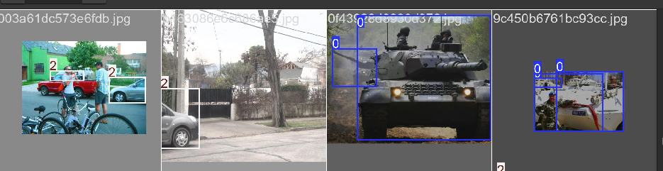
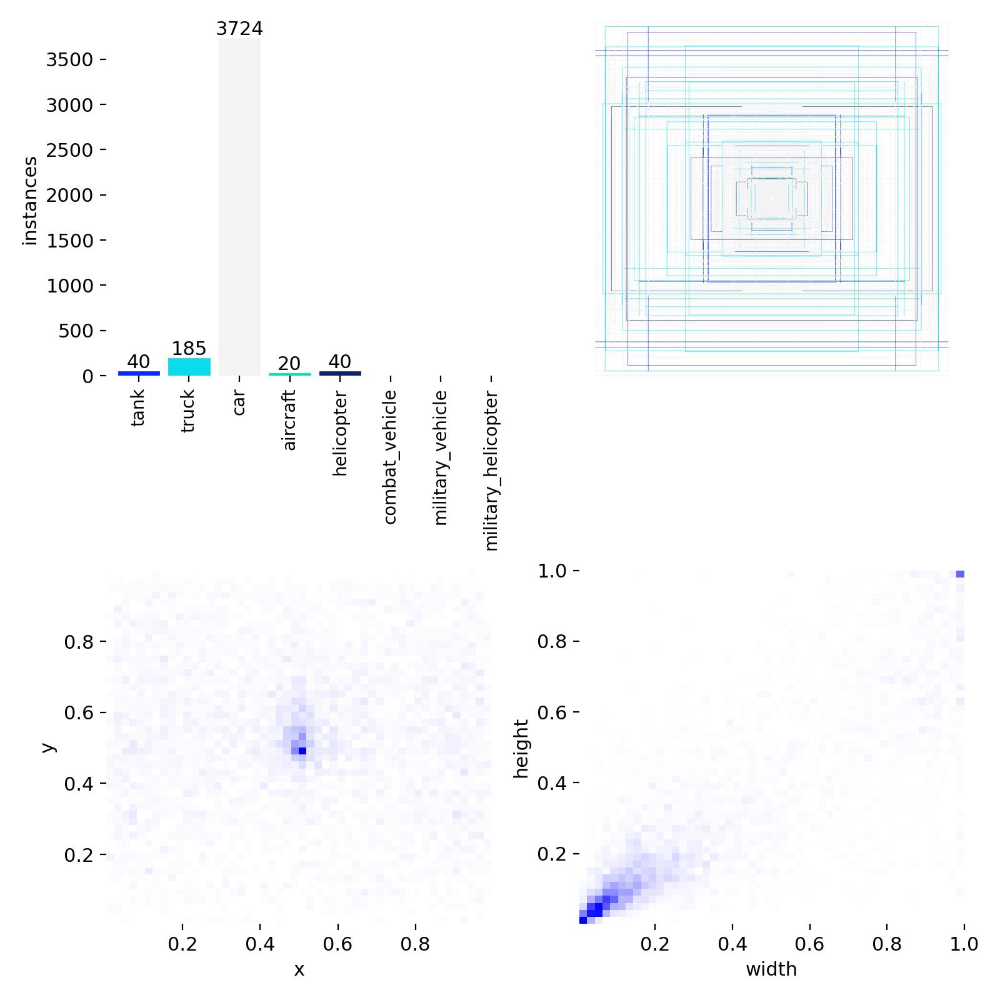

# Military Vehicles YOLO Detector

Custom YOLOv8 pipeline for detecting military vehicles in both ground-level and aerial/ISR imagery.
Goal: train a model that can recognize diverse vehicles (tanks, APCs, artillery, trucks, aircraft, helicopters, ships) in realistic, potentially battlefield-like conditions.

## Motivation

Off-the-shelf detectors are biased toward civilian categories (car, bus, truck).

Open datasets (Open Images, DOTA, xView, RarePlanes) are rich but fragmented across formats (CSV, GeoJSON, OBB polygons).

Military vehicle classes are under-represented, so I built a dual-source pipeline to curate, merge, and train one unified detector.

## Pipeline
```bash
# preliminaries
python -m venv .venv && source .venv/bin/activate
pip install -r requirements.txt

# download images via fiftyone of these classes
python scripts/openimages_to_yolo.py --out data --classes Tank Truck Car Aircraft Helicopter "Combat vehicle" "Military vehicle" "Military helicopter"

# train the new model with the new data
python src/train_dual.py --data milveh.yaml --model yolov8n.pt --img-min 640 --img-max 768 --epochs 300  --batch 32

# get the performance results and deposit them into runs/detect/val<next_highest_number>
python src/eval_export.py --run runs/detect/train_dual<highest_number>

# copy some pictures into demo/sample and the results will go into runs/detect/predict<next_highest_number>
python src/infer.py --weights runs/detect/train<highest_number>/weights/best.pt --source demo/sample


# gradio fancy web demo
python app.py --weights runs/detect/train_dual<highest_number>/weights/best.pt
```

## Preliminary EDA



During dataset curation I noticed:

* “Car” dominates Open Images — massively larger than other classes.
  * Risk: model will bias toward cars, under-predict rare military categories.
* Aerial sets (DOTA) provide many small-vehicle and large-vehicle labels, but class balance vs ground is uneven.
* Some classes are extremely rare (artillery, SAM/AA), not well covered by public datasets.

Next step: rebalance or remap classes. Options include:

* Collapsing Car + SUV into a broader “light vehicle” category.
* Oversampling rare categories (duplicate labels/images).
* Adding synthetic augmentation (e.g. RarePlanes synthetic → real transfer).
